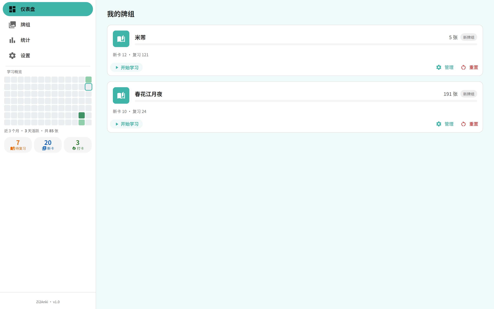
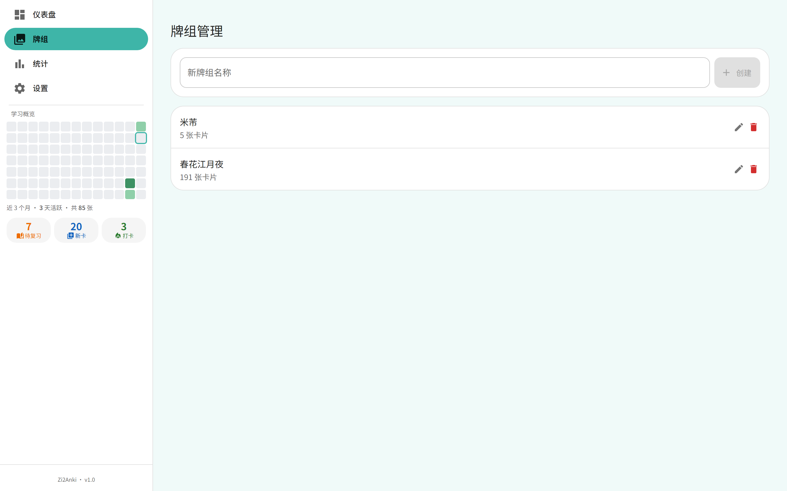
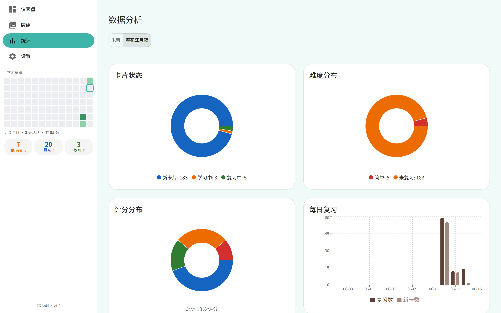

# 字2Anki (Zi2Anki)

> 书法单字记忆工具 · 基于 SM-2 间隔重复算法，专为书法爱好者设计

**Zi2Anki** 是一款专为书法学习者设计的间隔重复记忆工具。将书法字帖中的单字以图片或文本形式导入后，通过 SM-2 算法自动安排每日复习，让字形记忆变得高效而持久。

---

## 截图

| PC 端双栏布局 | 牌组管理 | 学习统计 |
|:---:|:---:|:---:|
|  |  |  |

---

## 功能特性

- **PC 双栏布局** — 左侧固定 280px 菜单（导航 + 学习概览紧凑版热力图 + 统计卡），右侧自适应主区
- **Mobile 适配** — 移动端自动切换底部 tab 布局，保留完整体验
- **牌组管理** — 按字帖/碑帖创建牌组，分类管理书法单字卡片
- **SM-2 算法** — 经典间隔重复算法（3 步学习阶梯：1min → 3min → 10min → 毕业）
- **卡片预览** — 点击卡片即可预览正面/背面内容，支持上/下一张翻页
- **批量导入** — 支持批量上传图片 + 文本批量导入（每两行一组卡片）
- **学习统计** — 签到日历热力图（13 周 × 7 天）、每日学习量、连续打卡、评分分布
- **学习中断恢复** — 中断学习时进度自动保留，已有评分不会丢失
- **每日上限** — 按牌组设置新卡/复习每日上限，合理规划学习节奏
- **响应式设计** — PC 端双栏 + 移动端底部 tab，全屏适配
- **本地优先** — SQLite 存储，无需网络即可使用

---

## 技术栈

| 层 | 技术 |
|---|------|
| 前端框架 | React 18 + TypeScript |
| UI 组件 | MUI (Material UI) v5 |
| 样式 | Tailwind CSS 3 |
| 状态管理 | Zustand |
| 路由 | React Router 6 |
| 构建工具 | Vite 5 |
| 后端 | Express 5 + TypeScript (tsx) |
| 数据库 | better-sqlite3 |
| 算法 | SM-2（纯函数实现，53 项测试覆盖） |
| 进程管理 | PM2（生产环境） |
| 部署 | SCP 直传（不走 GitHub） |

---

## 快速开始

### 环境要求

- Node.js >= 18
- npm >= 9

### 安装与运行

```bash
git clone https://github.com/zaxchou/zi2anki.git
cd zi2anki

# 安装依赖
npm install

# 创建上传目录
mkdir -p uploads

# 启动后端（端口 3001）
npx tsx server/index.ts

# 新终端，启动前端（端口 3000）
npx vite --port 3000
```

打开浏览器访问 `http://localhost:3000`

### 一键启动（Windows）

```bash
start.bat
```

---

## 项目结构

```
zi2anki/
├── server/                  # Express 后端
│   ├── index.ts             # 服务入口
│   ├── db.ts                # SQLite 数据库初始化 + 迁移
│   └── routes/
│       ├── decks.ts         # 牌组 CRUD API
│       ├── cards.ts         # 卡片 CRUD + 批量导入 API
│       └── study.ts         # 学习会话 + 统计 API
├── src/                     # React 前端
│   ├── main.tsx             # 应用入口
│   ├── App.tsx              # 路由配置 + 主题
│   ├── components/
│   │   ├── common/          # 通用组件（对话框、加载态）
│   │   ├── dashboard/       # 仪表盘组件（统计卡、热力图日历）
│   │   ├── layout/          # 布局组件（SideMenu、AppShell、BottomNav）
│   │   └── study/           # 学习组件（闪卡、评分按钮、进度条）
│   ├── pages/               # 页面
│   │   ├── DashboardPage.tsx  # 仪表盘（牌组卡片 + 开始学习按钮）
│   │   ├── DecksPage.tsx      # 牌组列表
│   │   ├── CardManagePage.tsx # 卡片管理（添加/编辑/预览/翻页）
│   │   ├── StudyPage.tsx      # 学习页面（闪卡复习 + 返回确认）
│   │   ├── AnalyticsPage.tsx  # 学习数据统计
│   │   └── SettingsPage.tsx   # 系统设置
│   ├── hooks/               # 自定义 Hooks
│   │   └── useDashboardStats.ts  # 共享统计加载
│   ├── lib/
│   │   ├── api.ts           # Express API 客户端
│   │   ├── sm2.ts           # SM-2 算法实现
│   │   ├── constants.ts     # 全局常量
│   │   ├── db.ts            # Dexie 离线存储
│   │   ├── sync.ts          # Supabase 同步
│   │   └── supabase.ts      # Supabase 客户端
│   ├── stores/              # Zustand 状态管理
│   │   ├── useDeckStore.ts
│   │   ├── useStudyStore.ts
│   │   └── useSettingsStore.ts
│   ├── types/               # TypeScript 类型定义
│   └── __tests__/           # 单元测试（SM-2 算法 53 项）
├── docs/
│   ├── screenshots/         # 功能截图
│   └── system_design.md     # 系统设计文档
├── uploads/                 # 上传图片存储
├── start.bat                # Windows 一键启动脚本
├── package.json
├── vite.config.ts
└── tsconfig.json
```

---

## SM-2 算法

本项目实现了改进的 SM-2 间隔重复算法，3 步学习阶梯：

```
新卡 → 1 分钟（重来）→ 3 分钟（困难）→ 10 分钟（良好）→ 毕业
```

| 评分 | 按钮 | ease 变化 | 间隔变化 |
|------|------|-----------|----------|
| 1（重来） | 🔴 Again | -0.20 | 重置到 1 分钟 |
| 2（困难） | 🟡 Hard | -0.15 | 保持当前阶梯 |
| 3（良好） | 🟢 Good | 不变 | 进入下一步 |
| 4（简单） | 🔵 Easy | +0.15 | 直接毕业（4 天） |

学习阶梯：`[1, 3, 10]`（分钟），毕业间隔 = 1 天，后续每轮 × ease。

---

## API 概览

| 方法 | 路径 | 说明 |
|------|------|------|
| GET | `/api/decks` | 获取所有牌组 |
| POST | `/api/decks` | 创建牌组 |
| PUT | `/api/decks/:id` | 重命名牌组 |
| DELETE | `/api/decks/:id` | 删除牌组 |
| GET | `/api/decks/:id/cards` | 获取牌组下所有卡片 |
| POST | `/api/decks/:id/cards` | 添加单张卡片 |
| POST | `/api/decks/:id/cards/batch` | 批量导入图片 |
| PUT | `/api/cards/:id` | 更新卡片 |
| DELETE | `/api/cards/:id` | 删除卡片 |
| GET | `/api/decks/:id/due-cards` | 获取到期待复习卡片 |
| GET | `/api/decks/:id/new-cards` | 获取新卡片 |
| POST | `/api/study-sessions` | 创建学习会话 |
| PUT | `/api/study-sessions/:id` | 结束学习会话 |
| GET | `/api/due-counts` | 各牌组待复习数量 |
| GET/PUT | `/api/daily-stats/:date` | 每日统计 |
| GET | `/api/daily-stats/range` | 每日统计范围查询 |
| PUT | `/api/decks/:id/limits` | 设置每日学习上限 |
| POST | `/api/decks/:id/reset` | 重置牌组学习进度 |

---

## 相关项目

- **[molin-wiki](https://molin.wiki)** — 中国书画 AI 分析与知识平台（Vue3 + FastAPI + Qdrant）
- **[zi2anki-skills](https://github.com/zaxchou/zi2anki-skills)** — WorkBuddy 技能包：书法单字提取、碑帖裁切等自动化工具

---

## 部署

部署采用 SCP 直传方式（不走 GitHub）：

```bash
bash Z:\molin-wiki\deploy.sh anki       # 仅部署 zi2anki
bash Z:\molin-wiki\deploy.sh anki --full # 含 uploads 完整部署
```

生产环境：PM2 守护进程 + nginx 反向代理

---

## License

MIT
