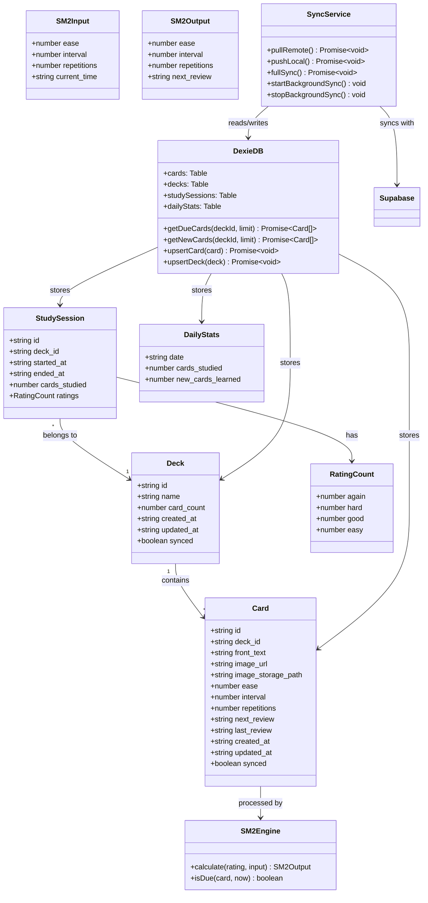
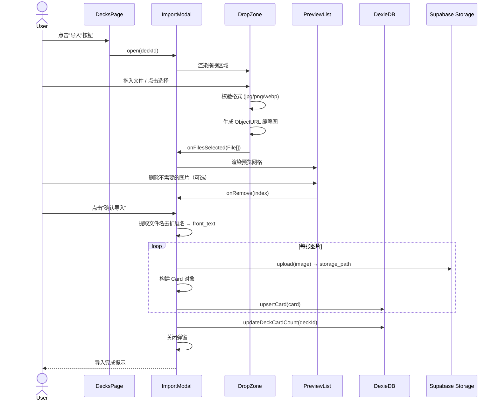
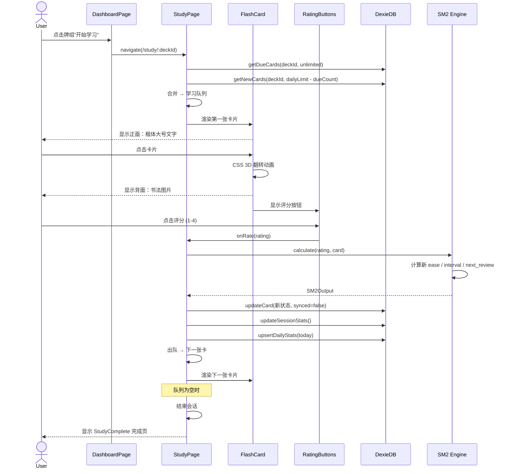
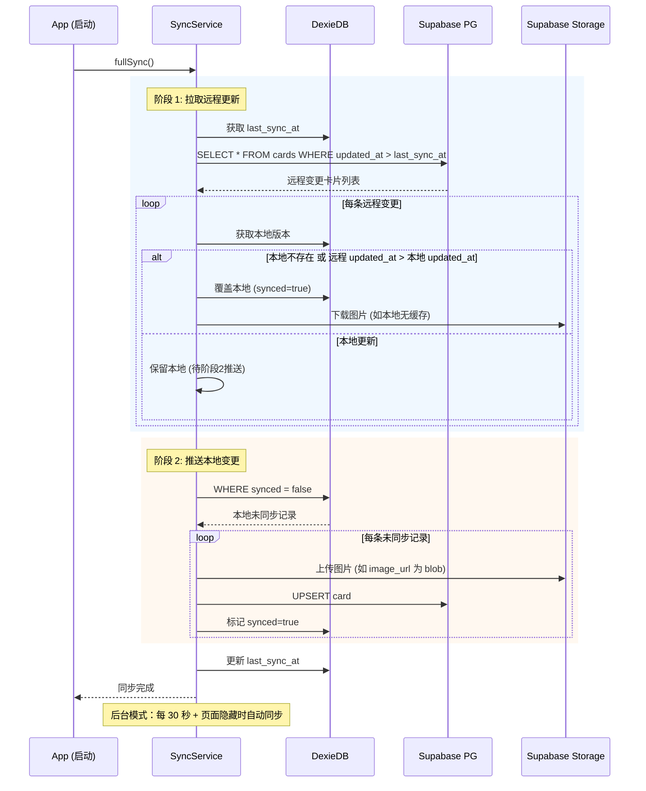
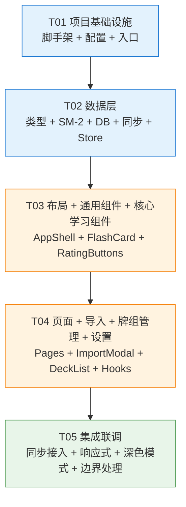

# 书法单字记忆工具 — 系统架构设计

> 版本: 1.0 | 日期: 2025-07-09 | 作者: Bob (Architect)

---

## Part A: 系统设计

### 1. 实现方案

#### 1.1 核心技术挑战

| 挑战 | 方案 |
|------|------|
| 离线可用 + 多端同步 | **Local-First 架构**：IndexedDB 为主存储，Supabase 为同步备份，最后写入胜出 |
| 图片批量导入 | 浏览器 File API + FileReader 缩略图生成 + Supabase Storage 原图上传 |
| SM-2 间隔重复 | 纯函数算法模块，无副作用，输入卡片状态 → 输出下一状态 |
| 卡片翻转动画 | CSS 3D Transform `rotateY(180deg)`，GPU 加速 |
| 响应式适配 | MUI `useMediaQuery` + Tailwind 响应式断点 |

#### 1.2 框架与库选型

| 类别 | 选型 | 理由 |
|------|------|------|
| 构建工具 | Vite 5 | 极速 HMR，原生 ESM |
| UI 框架 | React 18 + TypeScript 5 | PRD 指定 |
| 组件库 | MUI v5 (`@mui/material`) | 完整的移动端触摸支持、Dialog/BottomNavigation 开箱即用 |
| 样式 | Tailwind CSS 3 | 配合 MUI sx prop 做细粒度调整 |
| 路由 | React Router v6 | 标准方案，嵌套路由支持好 |
| 状态管理 | **Zustand** | 比 Redux 轻 10 倍，比 Context 性能好，支持 persist 中间件直接对接 localStorage |
| 本地数据库 | **Dexie.js** (IndexedDB wrapper) | 比原生 IndexedDB API 简洁，支持版本迁移 |
| 后端/同步 | Supabase JS SDK v2 | PostgreSQL + Storage + 匿名认证 |
| SM-2 算法 | 自实现（纯函数，~50 行） | 逻辑简单，无需第三方库 |
| UUID | `crypto.randomUUID()` (浏览器原生) | 零依赖 |

#### 1.3 架构模式

采用 **分层架构**，前端内部按 **Component/Store/Service** 三层划分：

```
┌─────────────────────────────────────────┐
│              Pages (路由页面)             │
├─────────────────────────────────────────┤
│  Components (UI 组件，不含业务逻辑)       │
├─────────────────────────────────────────┤
│  Stores (Zustand，UI 状态 + 缓存)        │
├──────────┬──────────┬───────────────────┤
│ Dexie DB │ SM-2     │ Supabase Client   │
│ (本地库)  │ (算法)    │ (远端同步)         │
└──────────┴──────────┴───────────────────┘
```

#### 1.4 同步策略

```
启动 App
  └→ 拉取远程更新 (updated_at > 本地 last_sync)
       ├→ 逐条比对：远程 updated_at > 本地 → 覆盖本地
       └→ 推送本地变更 (synced=false 的记录)
            └→ 写入远程，标记 synced=true

学习过程
  └→ 写 IndexedDB + 标记 synced=false + 加入同步队列
       └→ 后台节流同步 (每 5 秒或页面隐藏时)
```

冲突解决：**最后写入胜出** (last-write-wins)，以 `updated_at` 字段为准。

---

### 2. 文件列表

```
src/
├── main.tsx                         # React 入口，挂载 App
├── App.tsx                          # 路由定义 + 全局 Provider 包裹
├── index.css                        # Tailwind 指令 + 全局重置样式
├── vite-env.d.ts                    # Vite 类型声明

├── types/
│   ├── index.ts                     # 核心类型: Card, Deck, StudySession, DailyStats, Rating
│   └── supabase.ts                  # Supabase 数据库表行类型映射

├── lib/
│   ├── constants.ts                 # 全局常量：SM-2 参数默认值、存储桶名、分页大小等
│   ├── sm2.ts                       # SM-2 算法纯函数：calculateNextReview()
│   ├── db.ts                        # Dexie 数据库实例 + 表定义
│   ├── supabase.ts                  # Supabase 客户端初始化（匿名认证）
│   └── sync.ts                      # 同步服务：pullRemote(), pushLocal(), startBackgroundSync()

├── stores/
│   ├── useDeckStore.ts              # 牌组列表状态 + CRUD 操作
│   ├── useStudyStore.ts             # 当前学习会话状态 + 卡片队列 + 评分分发
│   └── useSettingsStore.ts          # 用户设置（新卡上限、深色模式）+ 持久化到 localStorage

├── hooks/
│   ├── useCards.ts                  # 卡片查询 hooks：useDueCards(), useNewCards()
│   ├── useSync.ts                   # 同步状态 hook：在线状态、上次同步时间
│   ├── useDarkMode.ts              # 深色模式 hook（跟随系统 / 手动切换）
│   └── useStreak.ts                # 连续打卡天数计算 hook（基于 DailyStats）

├── components/
│   ├── layout/
│   │   ├── AppShell.tsx            # 主布局容器：TopBar + 内容区 + BottomNav
│   │   ├── BottomNav.tsx           # 底部导航栏（仪表盘/牌组/设置）
│   │   └── TopBar.tsx              # 顶栏（页面标题 + 操作按钮）

│   ├── dashboard/
│   │   ├── StatsBar.tsx            # 今日统计条：待复习 / 新卡剩余 / 打卡天数
│   │   ├── DeckList.tsx            # 牌组快捷列表（含"开始"按钮）
│   │   └── StreakBadge.tsx         # 连续打卡天数徽章

│   ├── study/
│   │   ├── FlashCard.tsx           # 翻卡组件（CSS 3D 翻转 + 正面文字 / 背面图片）
│   │   ├── RatingButtons.tsx       # 4 按钮：Again / Hard / Good / Easy
│   │   ├── ProgressBar.tsx         # 学习进度条
│   │   └── StudyComplete.tsx       # 学习完成页（本次统计 + 返回按钮）

│   ├── decks/
│   │   ├── DeckListItem.tsx        # 单个牌组行（名称 + 卡片数 + 操作菜单）
│   │   ├── DeckFormDialog.tsx      # 创建 / 重命名牌组对话框
│   │   └── EmptyDeck.tsx           # 空牌组占位提示

│   ├── import/
│   │   ├── ImportModal.tsx         # 导入弹窗（全屏 Dialog，含步骤流转）
│   │   ├── DropZone.tsx            # 拖拽/点击上传区域
│   │   └── PreviewList.tsx         # 图片预览网格（可删除单张）

│   ├── settings/
│   │   ├── NewCardLimit.tsx        # 新卡上限滑块/输入
│   │   ├── DarkModeToggle.tsx      # 深色模式切换开关
│   │   └── SyncStatus.tsx          # 同步状态指示条

│   └── common/
│       ├── ConfirmDialog.tsx       # 通用确认对话框
│       └── LoadingState.tsx        # 通用加载占位

├── pages/
│   ├── DashboardPage.tsx           # /dashboard
│   ├── StudyPage.tsx               # /study/:deckId
│   ├── DecksPage.tsx               # /decks
│   ├── SettingsPage.tsx            # /settings
│   └── NotFoundPage.tsx            # 404

└── utils/
    ├── formatters.ts               # 日期/时长/数量格式化
    └── validators.ts               # 文件名校验、图片格式校验
```

**总计 41 个源文件。**

---

### 3. 数据结构与接口



#### TypeScript 接口定义

```typescript
// ===== types/index.ts =====

/** SM-2 评分等级 */
export type Rating = 1 | 2 | 3 | 4;
// 1 = Again, 2 = Hard, 3 = Good, 4 = Easy

/** 单张卡片 */
export interface Card {
  id: string;
  deck_id: string;
  front_text: string;           // 正面文字（从文件名提取）
  image_url: string;             // 本地 ObjectURL 或远程 Supabase Storage URL
  image_storage_path: string;    // Supabase Storage 路径（如 public/deck-xxx/card-xxx.jpg）
  ease: number;                  // SM-2 ease factor，默认 2.5，最小 1.3
  interval: number;              // 下次间隔（分钟），0 = 新卡未学
  repetitions: number;           // 复习次数
  next_review: string;           // ISO 8601 UTC 时间，下次复习时刻
  last_review: string | null;    // 上次复习时间
  created_at: string;            // 创建时间
  updated_at: string;            // 最后修改时间（同步判定字段）
  synced: boolean;               // 是否已同步到 Supabase
}

/** 牌组 */
export interface Deck {
  id: string;
  name: string;
  card_count: number;
  created_at: string;
  updated_at: string;
  synced: boolean;
}

/** 单次学习会话 */
export interface StudySession {
  id: string;
  deck_id: string;
  started_at: string;
  ended_at: string | null;
  cards_studied: number;
  ratings: { again: number; hard: number; good: number; easy: number };
}

/** 每日统计 */
export interface DailyStats {
  date: string;                  // YYYY-MM-DD 格式
  cards_studied: number;
  new_cards_learned: number;
}

/** SM-2 算法输入 */
export interface SM2Input {
  ease: number;
  interval: number;
  repetitions: number;
}

/** SM-2 算法输出 */
export interface SM2Output {
  ease: number;
  interval: number;
  repetitions: number;
  next_review: string;           // ISO 8601
}

/** 用户设置 */
export interface UserSettings {
  dailyNewCardLimit: number;     // 默认 20
  darkMode: 'system' | 'light' | 'dark';
  lastSyncAt: string | null;
}
```

```typescript
// ===== types/supabase.ts =====

/** Supabase cards 表行 */
export interface CardRow {
  id: string;
  deck_id: string;
  front_text: string;
  image_storage_path: string;
  ease: number;
  interval: number;
  repetitions: number;
  next_review: string;
  last_review: string | null;
  created_at: string;
  updated_at: string;
}

/** Supabase decks 表行 */
export interface DeckRow {
  id: string;
  name: string;
  card_count: number;
  created_at: string;
  updated_at: string;
}

/** Supabase daily_stats 表行 */
export interface DailyStatsRow {
  date: string;
  cards_studied: number;
  new_cards_learned: number;
  updated_at: string;
}
```

---

### 4. 程序调用流程

#### 4.1 导入图片流程



#### 4.2 学习翻卡流程



#### 4.3 同步流程



---

### 5. 待明确事项

| # | 问题 | 假设 |
|---|------|------|
| 1 | Supabase 匿名认证的 `anon` key 是否已配置 RLS 策略？ | 假设已配置：用户只能读写自己的数据（通过 `auth.uid()` 或设备 ID） |
| 2 | 匿名用户跨设备如何关联？ | 假设使用浏览器的匿名登录 `signInAnonymously()`，同一设备持久化 `user_id`；跨设备暂不关联 |
| 3 | Supabase Storage 桶名？ | 假设 `calligraphy-images`，公共可读策略 |
| 4 | 图片同步策略：原图上传还是缩略图？ | 假设原图上传（≤10MB），前端本地缓存 ObjectURL |
| 5 | 多字文件名如"天地.jpg"分隔符？ | 假设不去分隔，"天地"整体作为一张卡的正面文字 |

---

## Part B: 任务分解

### 6. 依赖包列表

```
- react@^18.3.1                              # UI 框架
- react-dom@^18.3.1                          # React DOM 渲染
- react-router-dom@^6.26.0                   # 路由
- @mui/material@^5.16.0                      # MUI 组件库
- @mui/icons-material@^5.16.0               # MUI 图标
- @emotion/react@^11.13.0                    # MUI 依赖：CSS-in-JS
- @emotion/styled@^11.13.0                   # MUI 依赖：styled API
- zustand@^4.5.0                             # 状态管理
- dexie@^4.0.0                               # IndexedDB 封装
- @supabase/supabase-js@^2.45.0             # Supabase SDK
- tailwindcss@^3.4.0                         # 原子化 CSS 框架
- postcss@^8.4.0                             # Tailwind 依赖
- autoprefixer@^10.4.0                       # Tailwind 依赖
```

开发依赖：

```
- typescript@^5.5.0                          # TypeScript 编译器
- vite@^5.4.0                                # 构建工具
- @vitejs/plugin-react@^4.3.0               # Vite React 插件
- @types/react@^18.3.0                       # React 类型
- @types/react-dom@^18.3.0                   # ReactDOM 类型
```

---

### 7. 任务列表（按依赖顺序）

#### T01: 项目基础设施

| 字段 | 内容 |
|------|------|
| **Task ID** | T01 |
| **任务名称** | 项目基础设施：脚手架 + 配置 + 入口文件 |
| **优先级** | P0 |
| **依赖** | 无 |
| **源文件** | |
| | `package.json` — 依赖声明 + scripts |
| | `tsconfig.json` — TypeScript 配置 |
| | `tsconfig.node.json` — Vite Node 端 TS 配置 |
| | `vite.config.ts` — Vite 配置（React 插件 + 路径别名） |
| | `tailwind.config.ts` — Tailwind 配置（content 路径 + MUI 兼容） |
| | `postcss.config.js` — PostCSS 配置 |
| | `index.html` — HTML 入口 |
| | `src/main.tsx` — React 入口 |
| | `src/App.tsx` — 路由定义 + 全局 Provider 骨架 |
| | `src/index.css` — Tailwind 指令 + 全局样式 + 字体引入 |
| | `src/vite-env.d.ts` — Vite 客户端类型声明 |
| **描述** | 初始化 Vite + React + TS 项目，安装所有依赖，配置 Tailwind + MUI 共存，配置路径别名 `@/`，建立 5 条路由骨架，引入楷体字体。App.tsx 中完成：ThemeProvider (MUI) + BrowserRouter + Routes 骨架。 |

---

#### T02: 数据层：类型 + 算法 + 数据库 + 同步

| 字段 | 内容 |
|------|------|
| **Task ID** | T02 |
| **任务名称** | 数据层：类型定义 + SM-2 算法 + IndexedDB + Supabase + 状态管理 |
| **优先级** | P0 |
| **依赖** | T01 |
| **源文件** | |
| | `src/types/index.ts` — Card, Deck, StudySession, DailyStats, Rating, SM2Input, SM2Output, UserSettings |
| | `src/types/supabase.ts` — CardRow, DeckRow, DailyStatsRow |
| | `src/lib/constants.ts` — SM2_DEFAULTS, STORAGE_BUCKET, SYNC_INTERVAL, MAX_IMAGE_SIZE 等 |
| | `src/lib/sm2.ts` — calculateNextReview(rating, input): SM2Output + isDue(card, now): boolean |
| | `src/lib/db.ts` — Dexie 数据库实例，4 张表：cards / decks / studySessions / dailyStats |
| | `src/lib/supabase.ts` — createClient() + signInAnonymously() |
| | `src/lib/sync.ts` — SyncService 类：fullSync / pullRemote / pushLocal / startBackgroundSync |
| | `src/stores/useDeckStore.ts` — Zustand store：decks[],  CRUD 方法，从 Dexie 加载 |
| | `src/stores/useStudyStore.ts` — Zustand store：当前队列、进度、评分分发 |
| | `src/stores/useSettingsStore.ts` — Zustand store + persist 中间件 → localStorage |
| **描述** | 建立全部数据基础设施。SM-2 算法为纯函数模块，需单元测试覆盖。Zustand store 通过 Dexie 读写数据、调用 SM-2 计算。SyncService 使用 supabase client 实现拉推逻辑。Database 表需定义复合索引（deck_id + next_review），支持高效查询到期卡片。 |

---

#### T03: 布局框架 + 通用组件 + 核心学习组件

| 字段 | 内容 |
|------|------|
| **Task ID** | T03 |
| **任务名称** | 布局框架 + 通用组件 + 学习核心组件 |
| **优先级** | P0 |
| **依赖** | T02 |
| **源文件** | |
| | `src/components/common/ConfirmDialog.tsx` — 通用确认对话框 |
| | `src/components/common/LoadingState.tsx` — 加载/空状态占位 |
| | `src/components/layout/TopBar.tsx` — 顶栏组件 |
| | `src/components/layout/BottomNav.tsx` — 底部导航栏（3 个入口） |
| | `src/components/layout/AppShell.tsx` — 主布局容器（TopBar + `<Outlet />` + BottomNav） |
| | `src/components/study/FlashCard.tsx` — 翻卡组件（CSS 3D transform，正面楷体文字 / 背面图片） |
| | `src/components/study/RatingButtons.tsx` — 4 按钮评分组件 |
| | `src/components/study/ProgressBar.tsx` — 学习进度条 |
| | `src/components/study/StudyComplete.tsx` — 完成页 |
| | `src/components/dashboard/StatsBar.tsx` — 今日统计条 |
| | `src/components/dashboard/StreakBadge.tsx` — 打卡徽章 |
| **描述** | 构建全部 UI 组件。FlashCard 为核心交互组件，需实现：① 正面楷体大号文字居中；② 点击触发 3D 翻转动画（0.4s ease）；③ 背面图片居中适配（object-contain）；④ 翻转后底部显示评分按钮。AppShell 使用 MUI BottomNavigation + react-router `useNavigate` 实现路由切换。StatsBar 从 useDeckStore/useStudyStore 读取数据。 |

---

#### T04: 页面组件 + 导入功能 + 牌组管理 + 设置

| 字段 | 内容 |
|------|------|
| **Task ID** | T04 |
| **任务名称** | 页面组件 + 导入弹窗 + 牌组管理 + 设置页 |
| **优先级** | P0/P1 |
| **依赖** | T03 |
| **源文件** | |
| | `src/pages/DashboardPage.tsx` — 仪表盘页面（StatsBar + DeckList + StreakBadge） |
| | `src/pages/StudyPage.tsx` — 学习页面（状态机：loading → 学习中 → 完成） |
| | `src/pages/DecksPage.tsx` — 牌组管理页面 |
| | `src/pages/SettingsPage.tsx` — 设置页面 |
| | `src/pages/NotFoundPage.tsx` — 404 页面 |
| | `src/components/dashboard/DeckList.tsx` — 牌组列表（含"开始学习"入口） |
| | `src/components/decks/DeckListItem.tsx` — 单牌组行 |
| | `src/components/decks/DeckFormDialog.tsx` — 创建/重命名弹窗 |
| | `src/components/decks/EmptyDeck.tsx` — 空状态 |
| | `src/components/import/ImportModal.tsx` — 导入弹窗主控 |
| | `src/components/import/DropZone.tsx` — 拖拽上传区 |
| | `src/components/import/PreviewList.tsx` — 图片预览网格 |
| | `src/components/settings/NewCardLimit.tsx` — 新卡上限设置 |
| | `src/components/settings/DarkModeToggle.tsx` — 深色模式切换 |
| | `src/components/settings/SyncStatus.tsx` — 同步状态 |
| | `src/hooks/useCards.ts` — useDueCards / useNewCards |
| | `src/hooks/useSync.ts` — 同步状态 hook |
| | `src/hooks/useDarkMode.ts` — 深色模式 hook |
| | `src/hooks/useStreak.ts` — 打卡统计 hook |
| | `src/utils/formatters.ts` — 日期/时长/数量格式化 |
| | `src/utils/validators.ts` — 文件名校验 |
| **描述** | 组装全部页面。StudyPage 是核心：从 URL 获取 deckId → 加载队列 → 逐张展示 FlashCard → 接收评分 → 调用 SM-2 → 更新数据库 → 下一张。ImportModal 需处理：拖拽 → 校验格式 → 预览 → 确认上传 Supabase Storage → 写 IndexedDB。DashboardPage 首页显示"今日待复习数"（due count）和"新卡剩余数"（limit - today's new）。 |

---

#### T05: 集成联调 + 同步 + 响应式 + 深色模式 + 最终打磨

| 字段 | 内容 |
|------|------|
| **Task ID** | T05 |
| **任务名称** | 集成联调 + 同步服务接入 + 响应式适配 + 深色模式 + 边界处理 |
| **优先级** | P1 |
| **依赖** | T04 |
| **源文件** | |
| | `src/App.tsx` — 接入 SyncService 启动同步 + 全局 ErrorBoundary |
| | `src/lib/sync.ts` — 完善：重试机制、网络检测、离线队列 |
| | `src/stores/useSettingsStore.ts` — 深色模式逻辑完善 |
| | `src/hooks/useDarkMode.ts` — 跟随系统 + 手动切换优先级 |
| | `src/components/layout/AppShell.tsx` — 响应式断点适配（桌面宽屏双栏 / iPad / iPhone 单栏） |
| | `src/components/study/FlashCard.tsx` — 深色模式下图片区强制浅色背景 |
| | `src/components/settings/SyncStatus.tsx` — 在线/离线/同步中状态指示 |
| | `src/index.css` — 响应式工具类 + 动画微调 |
| | 各 Page 组件 — 加载态、空态、错误态补全 |
| **描述** | 端到端集成。确保完整流程通顺：安装 → 创建牌组 → 导入图片 → 学习 → 评分 → 同步。响应式覆盖 3 个断点（<600 / 600-960 / >960）。深色模式：书法图片区保持 `#fafafa` 浅色背景。所有异常状态需有 UI 反馈（网络断开、Supabase 不可达、图片加载失败等）。 |

---

### 8. 共享知识（跨文件约定）

#### 命名规范

```
文件命名:     PascalCase 组件/页面, camelCase hooks/utils/stores/lib
组件命名:     PascalCase (FlashCard, RatingButtons)
Hook 命名:    use + PascalCase (useCards, useSync)
Store 命名:   use + Domain + Store (useDeckStore)
类型命名:     PascalCase (Card, Deck, StudySession)
常量命名:     UPPER_SNAKE_CASE (MAX_IMAGE_SIZE, SYNC_INTERVAL)
```

#### 全局常量 (`src/lib/constants.ts`)

```typescript
export const SM2_DEFAULTS = {
  INITIAL_EASE: 2.5,
  MIN_EASE: 1.3,
  EASY_BONUS: 1.3,
  AGAIN_EASE_DELTA: -0.20,
  HARD_EASE_DELTA: -0.15,
  EASY_EASE_DELTA: +0.15,
  GRADUATING_INTERVAL: 24 * 60,   // 1 天（分钟）
  EASY_GRADUATING_INTERVAL: 4 * 24 * 60, // 4 天
  INITIAL_STEPS: [1, 10],         // [1 分钟, 10 分钟]
} as const;

export const STORAGE_BUCKET = 'calligraphy-images';
export const MAX_IMAGE_SIZE = 10 * 1024 * 1024; // 10 MB
export const ALLOWED_IMAGE_TYPES = ['image/jpeg', 'image/png', 'image/webp'];
export const DEFAULT_DAILY_NEW_CARD_LIMIT = 20;
export const SYNC_INTERVAL = 30_000; // 30 秒
export const DECK_NAME_MAX_LENGTH = 50;
```

#### 通用约定

- **时间**: 所有时间戳使用 ISO 8601 UTC 字符串（`new Date().toISOString()`）
- **ID**: 使用 `crypto.randomUUID()` 生成
- **图片 URL**: 本地为 `blob:` 或 IndexedDB 缓存路径；远程为 Supabase Storage 公开 URL（`{supabaseUrl}/storage/v1/object/public/{bucket}/{path}`）
- **错误处理**: 所有 Supabase 调用需 try/catch，失败时降级到本地 IndexedDB 操作；UI 层通过 Zustand store 的 `error` 字段展示错误
- **深色模式图片区**: 无论系统主题如何，书法图片卡片背面始终使用浅色背景（`#fafafa` 或 MUI `grey[50]`）

#### Tailwind + MUI 共存约定

- 布局/间距/网格优先用 **Tailwind**（className）
- 交互组件（Button/Dialog/BottomNavigation/Slider/Toggle）优先用 **MUI**
- 字体使用 MUI Theme 配置 + Tailwind `font-serif` 工具类
- 卡片翻转动画使用 **CSS Module 或 Tailwind `@layer` 自定义类**，不通过 MUI

---

### 9. 任务依赖图



**图例**: 🔵 P0 核心 | 🟠 P0/P1 | 🟢 P1

---

*文档结束。下一步：主理人审阅后交由 Engineer 实现。*
